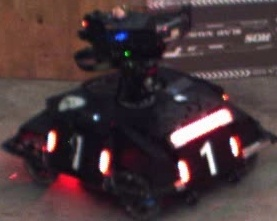
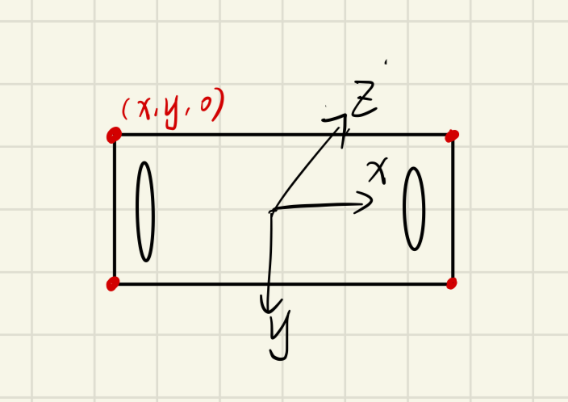

# 大作业

通过前面对于 CMake, C++ 和 OpenCV 学习相信你已经有一定的基础了，但是都还是一些局部的知识，是时候进行一些完整的项目实践了！

强烈推荐学完其他前置知识之后再来进行这个简单的小项目实践！

现在的你需要帮助学长编写一份可以实现自动瞄准装甲板的程序，帮助学长拿下比赛

## 自瞄

### 识别

我们先来看看装甲板的样子，想想我们应该如何找到一张图片中的装甲板

很明显装甲板两侧有非常明显的视觉特征，一对发光的灯条，图片中明显的视觉特征是我们使用传统视觉的基础

是否可以通过你前面学习的一些 OpenCV 知识找到图片中的这一对灯条，并且通过一定的处理获取到装甲板的四个角点在图像中的坐标和装甲板的图片

### PnP 解算

现在已经获取到了装甲板的角点坐标，但是我们的装甲板在三维世界中，我们只有图像中的二维坐标是不够的，所以我们需要一定的方法获取到装甲板的三维位姿

PnP Perspective-n-Point 是求解 3D 到 2D 点对运动的方法，目的是求解相机坐标系相对世界坐标系的位姿

通俗的讲，PnP 问题就是在已知世界坐标系下 N 个空间点的真实坐标以及这些空间点在图像上的投影，如何计算相机所在的位姿（已知量是空间点的真实坐标和图像坐标，未知量是相机的位姿）

我们可以通过人为设定一个坐标系，Z 轴垂直装甲板朝里 `z = 0`

这样我们就能有一个装甲板在这个自定义坐标系下的三维坐标了

有了这个坐标系之后我们就可以通过 PnP 算出相机坐标系到自定义坐标系的平移向量，即装甲板的三维坐标

---

这样最简单的自瞄代码大概就实现了！

但是这只实现了基础功能，现实中的装甲板是在移动的，而且我们的识别算法没有办法非常精确的识别到装甲板的位置，图像数据等也存在非常多的噪声，我们需要对结果进行**滤波处理**，下一时刻位置**预测**

滤波和预测是进阶部分的内容，感兴趣的同学可以自己尝试学习 `Kalman` 滤波，对 PnP 解算获得的三维装甲板坐标进行滤波和预测

### 补充知识
+ [坐标系的变化，相机坐标系，世界坐标系，像素坐标系](https://zhuanlan.zhihu.com/p/282497081)
+ [PnP解算](https://zhuanlan.zhihu.com/p/399140251)

