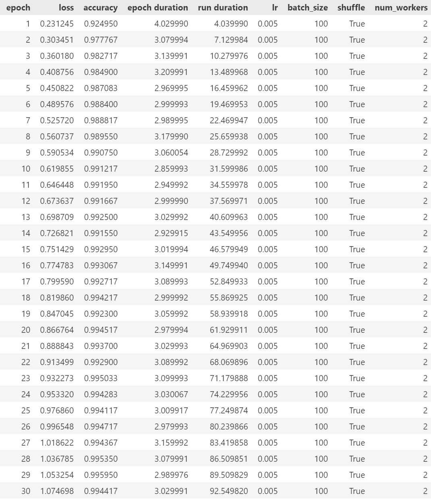
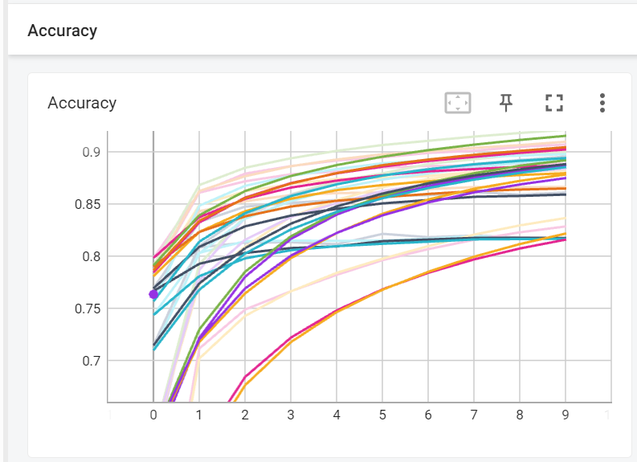

# Task
本任务建议在学过python和opencv进行。

神经网络是一种玄学的工具，在传统程序中我们希望能掌握代码的运行原理，但在一个复杂的目标检测网络中我们并不要求这一点。初学神经网络时，把它当成一个能拟合任何函数的黑盒能少受很多苦（是任何，比如“输入是图片(实际是矩阵)，输出是图片里的内容”这种无法用数学公式表示的函数）。

在RM中，我们只需要学习CNN(卷积神经网络)，你如果学有余力也可以学习一下Transformer，Self-Attention，甚至是强化学习RL，对抗学习（不要勉强）。

另外，神经网络有只有python一种语言，请不要尝试使用c++来折磨自己（除了部署时），推荐编辑器PyCharm，Jupyter Notebook

###### ps：以下卷积神经网络用网络代替

---

## 基础

首先学习Pytorch，这一个基于 Python 的科学计算库，可以将tensor代替numpy来尽可能利用GPU，同时更方便快速搭建网络。使用在安装时一定要选择带CUDA和GPU版本的Pytorch。(如果你已经学过Tensorflow也可以)

```
带*的任务只用了解，无需上交（但不是不重要）
```

#### task：

- 对张量(tensor)的基本运用：
  1. 创建一个5行3列的随机张量X
  2. 用pytorch内置函数检测X的shape，dtype，device
  3. 直接创建一个[[1,2,3,4,5],[6,7,8,9,10],[11,12,13,14,15]]的张量Y
  4. 用任意方法将Y的维度转变为5行3列
  5. 实现X和Y的加减乘除，同时了解abs()，sqrt()，neg()，mean()的作用
  6. *了解内置函数max()，argmax()，sum()，同时知道其内参dim的作用
  7. 将张量X转为Numpy格式，再将其转回来。
  8. 将张量X放到cuda上。
  9. *学会张量的拼接，解压，压缩，广播，以及Numpy的transpose函数

- 初步了解CNN的各个组成部分（该部分建议先自己找教程去学，然后照着任务复习）：

  ######   提示：有某个数学符号不认识时，截图喂给Google

  1. *了解网络的输入层，全连接层，输出层
  2. *了解卷积层、激活函数、池化层的作用
  3. *大致理解前向传播和反向传播的过程
  4. *学会选择优化器，调一些简单的超参数（学习率，epoch，batchsize等等）
  5. *学会用tensorboard可视化模型指标（loss, accuracy...）

-  数据集预处理：
  1. *了解数据集和标签的关系
  2. *了解训练集，验证集，测试集的关系
  3. *了解torchvision.datasets模块和学习torch.utils.data.DataLoader()函数
  4. *了解数据增强

-  最终考查——训练手写数字网络：
  1. 导入开源的MNIST数据集（只需要6w张的训练集），并进行归一化
  2. 制作批大小100的训练集
  3. 设计一个五层卷积网络（二卷积层，二全连接层，及输出层），优化器和激活函数自选
  4. 对所有全连接层进行正态分布权重初始化
  5. 在GPU上训练训练集50轮（epoch可改）
  6. 运用对张量的操作，至少获取loss和accuracy两个指标，并使用pandas或matplotlib或tensorboard制作表格或曲线。参考下图：
     
  7. 确保正确率在98%以上并保存权重（权重需要提交）

------


## 进阶

学完基础内容后，你已经入门了深度学习，~~接下来只需要调api就行（bushi~~  入门是最难的一步，接下来的任务会非常轻松

#### task：

- 继续了解神经网络的一些概念：
  1. *了解权重pt，onnx的区别
  2. *学会判断过拟合，欠拟合
  3. *了解梯度消失和梯度爆炸
  4. *了解残差块，BN层(BatchNormolization)

- 手写神经网络优化训练并学习使用验证集——在上面题目“训练手写数字网络”的基础上优化训练：
  1. 至少选用三个以上的超参，使用任意一种网格搜索算法搜寻超参组合
  2. 使用K折交叉验证法(设K为6)对每种组合进行评估（每种组合训练5到10轮），获取平均accuracy并制作对比曲线(使用tensorboard工具会非常方便)。参考下图：
     
  3. *使用最佳参数组合进行训练，检查模型是否有优化

***

## 目标检测网络

目前主流的OneStage目标检测网络是一种回归式的CNN，同时也是实验室最主要使用的网络。由于目标检测网络的主干和算法过于复杂，所以对大一的初步要求是只学使用，不求甚解。

#### task：

- 使用yolov5或yolov8对任意两种水果进行目标检测，并录制视频提交。

  ######    思路提供：1使用labelimg或者labelme进行数据集标注(每种水果大约200张以上，如果你会用数据增强则能节省大量标注时间)  

  ######                       2从GitHub克隆网络

  ######                       3在网上学习其ArgParse的作用

  ######                       4利用其提供的训练文件进行训练

***


完结撒花(∠・ω< )⌒☆


## 学习资料

+ [CSAI50](https://www.bilibili.com/video/BV1ua4y1d7oK/?spm_id_from=333.337.search-card.all.click)

+ [Dive into Deep Learning](https://d2l.ai/)

+ [吴恩达深度学习](https://www.bilibili.com/video/BV1ev4y1U7j2/?spm_id_from=333.337.search-card.all.click)
+ [yolo](https://pjreddie.com/darknet/yolo/)
+ [yolov5](https://github.com/ultralytics/yolov5)
+ 深度学习的资料非常多，我们推荐的不一定适合你们，还有许多可以自己寻找
