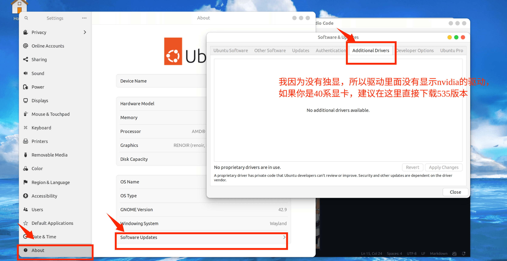
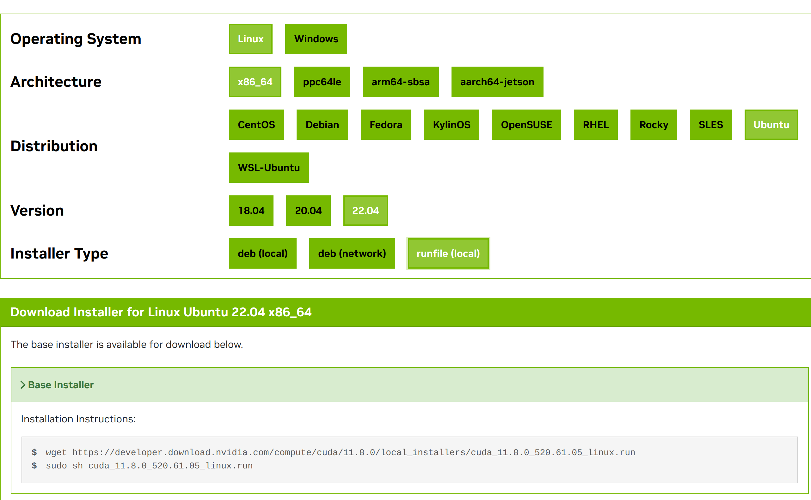
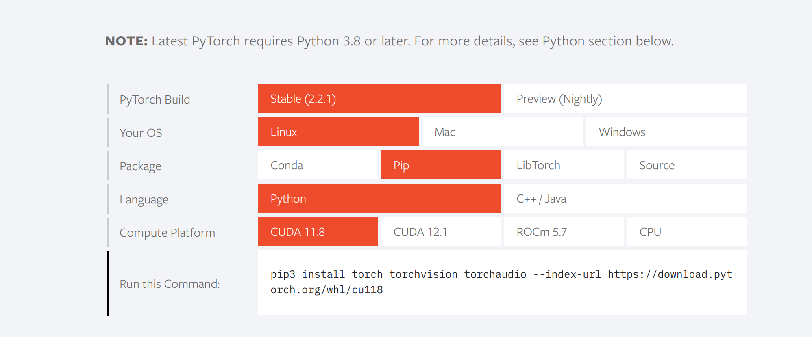

# 深度学习

## 软件安装
1. nvidia驱动

2. cuda

3. pytorch

4. anaconda

## nvidia 驱动
你可以使用linux的设置安装，教程如下：

## cuda
建议去nvidia的官网安装[cuda11.8](https://developer.nvidia.com/cuda-11-8-0-download-archive)

使用命令行安装

## pytorch

建议去[pytorch](https://pytorch.org/)官网安装

使用命令行安装

## anaconda

去[anaconda](https://www.anaconda.com/)官网，选择free down

你下载的是脚本文件

> source ./anaconda.sh(安装包脚本的名字)